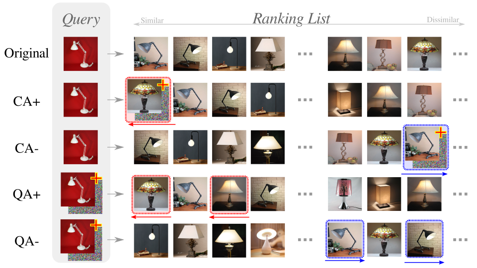
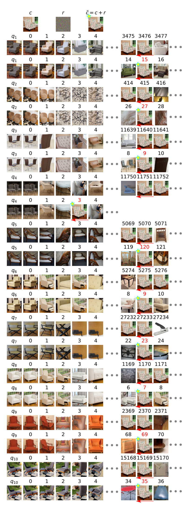

Adversarial Ranking Attack and Defense (ECCV2020)
===

Materials for ECCV-2020 Paper #2274.

* **Title:** Adversarial Ranking Attack and Defense
* **Authors:** Mo Zhou, Zhenxing Niu, Le Wang, Qilin Zhang, Gang Hua
* **Preprint:** [https://arxiv.org/abs/2002.11293](https://arxiv.org/abs/2002.11293)

The full version of preprint version (containing more graphics) can be found in the git repo.

## Abstract

Deep Neural Network (DNN) classifiers are vulnerable to adversarial attack,
where an imperceptible perturbation could result in misclassification. However,
the vulnerability of DNN-based image ranking systems remains under-explored. In
this paper, we propose two attacks against deep ranking systems, i.e.,
Candidate Attack and Query Attack, that can raise or lower the rank of chosen
candidates by adversarial perturbations. Specifically, the expected ranking
order is first represented as a set of inequalities, and then a triplet-like
objective function is designed to obtain the optimal perturbation. Conversely,
a defense method is also proposed to improve the ranking system robustness,
which can mitigate all the proposed attacks simultaneously. Our adversarial
ranking attacks and defense are evaluated on datasets including MNIST,
Fashion-MNIST, and Stanford-Online-Products. Experimental results demonstrate
that a typical deep ranking system can be effectively compromised by our
attacks. Meanwhile, the system robustness can be moderately improved with our
defense. Furthermore, the transferable and universal properties of our
adversary illustrate the possibility of realistic black-box attack. 

### Contributions

Definition of *Adversarial ranking attack*: adversarial ranking attack aims
*raise* or *lower* the ranks of some chosen candidates
C={c₁,c₂, ... ,cₘ} with respect to a specific query set
Q={q₁,q₂, ... ,qw}.
This can be achieved by either Candidate Attack (CA) or Query Attack (QA).

Contributions:

1. The adversarial ranking attack is defined and implemented, which can
intentionally change the ranking results by perturbing the candidates
or queries.

2. An adversarial ranking defense method is proposed to improve the
ranking model robustness, and mitigate all the proposed attacks
simultaneously.

Highlights:

1. The attacking goal of *Adversarial ranking attack* is far beyond simply "inducing
mis-ranking".
1. Capable of both point-to-point and point-to-set ranking attacks.
1. Able to preserve query semantics while perturbing the query image, making the
attack stealth enough to be noted.
1. Ranking-based loss function is better than distance-based function.
1. The proposed defense for deep ranking system is generic and effective.
1. The resulting adversarial examples are transferrable, and universal perturbation
is possible.

## Visualization Examples

## Code

Coming soon.
