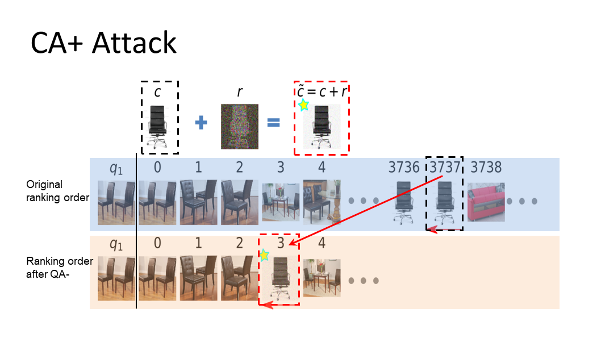
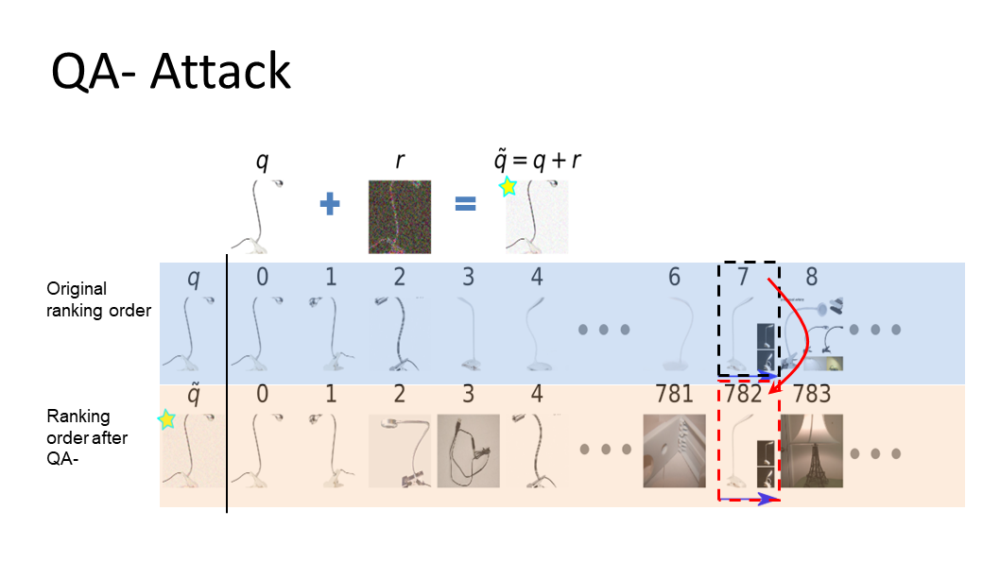
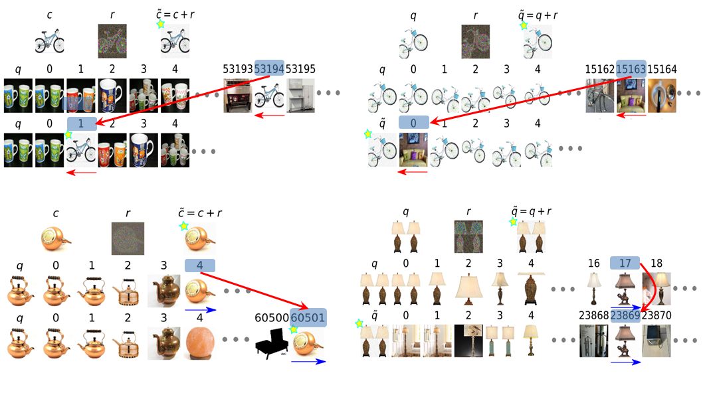

Adversarial Ranking Attack and Defense (ECCV2020)
===

Materials for ECCV-2020 Paper #2274.

* **Title:** Adversarial Ranking Attack and Defense
* **Authors:** Mo Zhou, Zhenxing Niu, Le Wang, Qilin Zhang, Gang Hua
* **Preprint:** [https://arxiv.org/abs/2002.11293](https://arxiv.org/abs/2002.11293)
* **Full-Preprint:** [2002.11293v3-full.pdf (with more graphs)](assets/2002.11293v3-full.pdf)

## Demonstration

## Contributions

Definition of *Adversarial ranking attack*: adversarial ranking attack aims
*raise* or *lower* the ranks of some chosen candidates C={c₁,c₂, ... ,cₘ} with
respect to a specific query set Q={q₁,q₂, ... ,qw}.  This can be achieved by
either Candidate Attack (CA) or Query Attack (QA).

1. The adversarial ranking attack is defined and implemented, which can
intentionally change the ranking results by perturbing the candidates
or queries.

2. An adversarial ranking defense method is proposed to improve the
ranking model robustness, and mitigate all the proposed attacks
simultaneously.

## Code

Coming soon.
